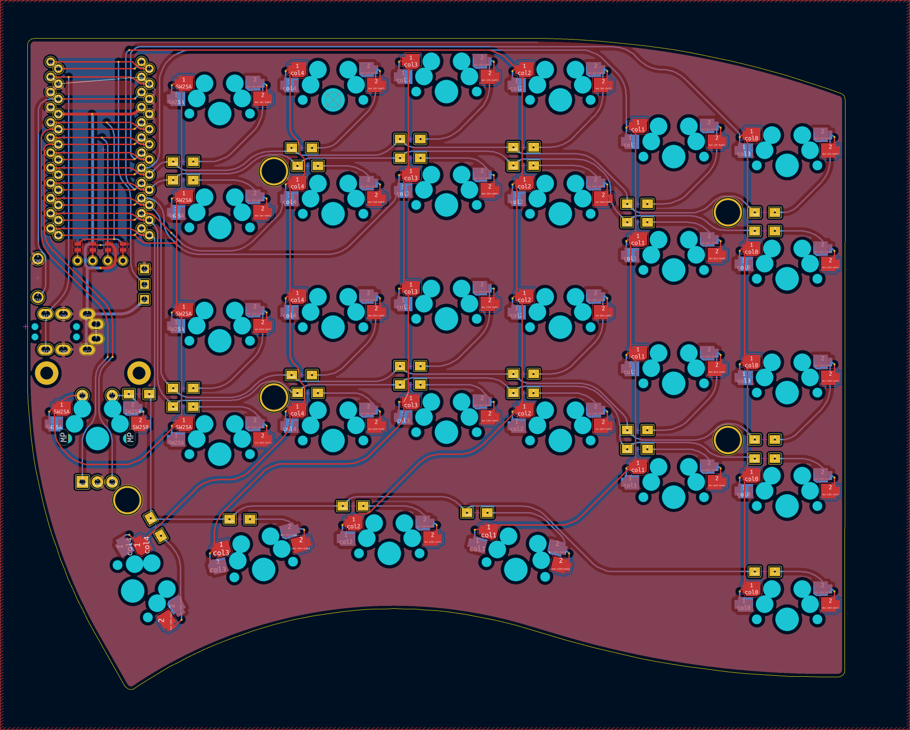

# Soufflé Keyboard

The Soufflé Keyboard is 6×4+1+4+1 keys column-staggered split keyboard with encoder support, based on the [Sofle](https://github.com/josefadamcik/SofleKeyboard) and re-inspired by the [Lily58](https://github.com/kata0510/Lily58) keyboards. It also takes a bit of layout ideas from the Kyria and the Ferris Sweep.

Soufflé was created by [Jesus Climent](https://https://github.com/climent/).

Key features:

*   Palm key at the bottom of the outer pinky column.
*   Choice between rotary encoder or key switch for the inner keys.
*   Removed i2c communication betweek halves.
*   Redone layout with simplified, curved tracks.
*   Originally based on the Soufflé V1 release layout,
    *   the two pinky columns have been lowered: ~5mm for the V1/V2, ~10mm for the V3 Sweep.
    *   the keys on the thumb cluster has been repositioned to allow for equal reach of the keys.
*   V3 adds support for nice!nano with solder points for a battery and a power switch. 

## Images of keyboard

## Build notes

Build guide will be added soon. Meanwhile, the [Sofle Build Guide](https://josefadamcik.github.io/SofleKeyboard/build_guide.html) should be a good starting point.

## ### BOM

| Item                                                       | Quantity | Notes                                                                                                                                                                                                                                                |
|------------------------------------------------------------|----------|------------------------------------------------------------------------------------------------------------------------------------------------------------------------------------------------------------------------------------------------------|
| Soufflé PCB                                                | 2        |                                                                                                                                                                                                                                                      |
| Spleeb Plates                                              | 2        | Gerber files are provided to be ordered made of FR4. Can be 3D printed, extruding the plate at 1.5 mm.                                                                                                                                               |
| SSD1306 128x64 OLED                                        | 2 (opt)  | Available from several sources.                                                                                                                                                                                                                      |
| Pro Micro pin MCU / Elite-C / Elite-Pi / Nice!nano         | 2        | RP2040 recomended.                                                                                                                                                                                                                                   |
| 2.54mm Round Hole Male Tin Gold Female Pin Headers, 40p    | 2 (opt)  | HIGHLY RECOMMENDED. However, If you want to solder the MCU directly to the board, this are not necessary.                                                                                                                                            |
| Mill Max socket pins                                       | 48 (opt) | Add 8 extra for the OLED screen, if used. Alternatively, socketing can be done with diode legs                                                                                                                                                       |
| TRRS 3.5 MM Audio Jack Connector Through Holes             | 2        |                                                                                                                                                                                                                                                      |
| Surface Momentary Tact Switch, 3mm x 4mm x 4.3mm           | 2        |                                                                                                                                                                                                                                                      |
| MSK12C02 power switches                                    | 2        | If using a nice!nano and batteries.                                                                                                                                                                                                                  |
| MX switches                                                | 60       |                                                                                                                                                                                                                                                      |
| Kailh MX hotswap switch sockets                            | 60       |                                                                                                                                                                                                                                                      |
| 1u keycaps                                                 | 60       |                                                                                                                                                                                                                                                      |
| 1.25u keycaps                                              | 2 (opt)  | Alternative to 2x 1u keybaps.                                                                                                                                                                                                                        |
| EC11 Encoder                                               | 2 (opt)  | Optional, as the board allows for either 2x encoders or switches.                                                                                                                                                                                    |
| Encoder knob, 16mm                                         | 2 (opt)  | If encoders are used                                                                                                                                                                                                                                 |
| 1N4148 Diodes                                              | 60       |                                                                                                                                                                                                                                                      |
| PJ-320A 3.5 mm jack                                        | 2        |                                                                                                                                                                                                                                                      |
| M2, 7 mm brass (or other material) spacers                 | 10       | These are the optimal spacers. Longer ones work, too, but with 7mm the gap is minimal                                                                                                                                                                |
| M2, 10 mm brass (or other material) spacers                | 4 (opt)  | If using OLED screens                                                                                                                                                                                                                                |
| M2x0.4mm, 5mm length flat head screws                      | 20       | 24x if using OLED screens                                                                                                                                                                                                                            |
| Battery, 10mAH                                             | 2        | If using nice!nano MCUs                                                                                                                                                                                                                              |

## Firmware 

Soufflé uses [QMK firmware](https://qmk.fm/) and it is fully compatible with the Sofle firmware.

## Default layout 

Soufflé uses a similar layout than the Sofle, with a full 6x5 matrix, and the encoders connected to the same pins. The main difference is the position of the outermost thumb key, which has been moved to the bottom of the pinky column, to be used with the palm.

## Older versions

In this repository you will find 3 releases of the Soufflé Keyboard:

*   V1: Based on the Sofle v1 and the Lily58. Key features:
    *   Added the palm key at the bottom of the pinky column.
    *   Some re-routing done and some label fixes, but modtly unchanged from the Sofle v1.
*   VR: Based on the Sofle RGB. Key features:
    *   Same palm key configuration then the V1.
    *   The layout footprint is based on the RGB, and thus the thumb cluster is slightly displaced to the center (compared to the V1).
    *   The encoder footprint shares a switch footprint, allowing for the user to choose what to put there.
    *   Pins for the encoder/switch have been exposed, as the top case plate can accommodate a roller encoder.
