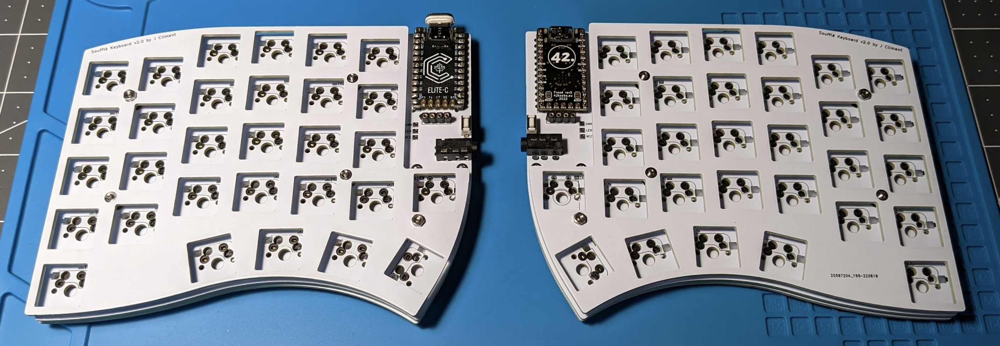

# Soufflé Keyboard v2

Soufflé v2 is 6×4+1+4+1 keys column-staggered split keyboard with encoder, OLED, and palm key support. It is an evolution of the Soufflé V1 and VR keyboard, with a slightly more aggressive arrangement of the pinkie columns.

Soufflé V2 was created by [Jesus Climent](https://https://github.com/climent/).

Key changes compared to the Soufflé V1:

*   Pinkie columns have been lowered ~5mm, to make them more accessible.
*   Thumb cluster repositioned, to make the keys slightly more accessible.
*   It is now possible to use switches in the position of the 2x rotary encoders.
*   Curved contour of the plates.

## Firmware 

Soufflé v2 uses [QMK firmware](https://qmk.fm/) and it is fully compatible with the Sofle firmware.

## Images of keyboard

