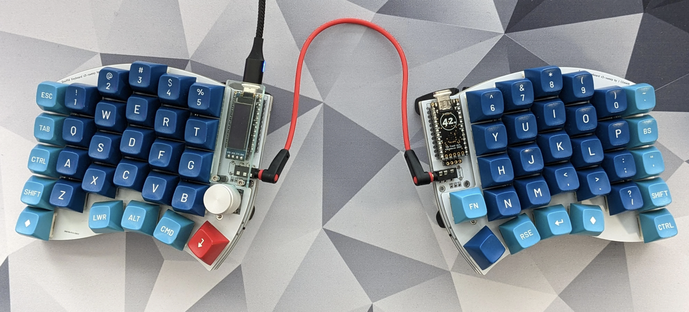

# Soufflé Keyboard v3 Sweep

Soufflé v3 is 6×4+1+4+1 keys column-staggered split keyboard with encoder, OLED, palm key and nice!nano support. It is an evolution of the Soufflé V2 keyboard, with a more aggressive arrangement of the pinkie columns.

Soufflé V3 Sweep was created by [Jesus Climent](https://https://github.com/climent/).

Key changes compared to the Soufflé V2:

*   Pinkie columns have been lowered ~5mm (~10mm compared to V1), to make them more accessible.
*   Middle finger column has been raised ~3mm.
*   Reset button has been moved to an internal position, and the lower plate has a hole, making it accessible from the bottom of the keyboard.
## Firmware 

Soufflé v3 Sweep uses [QMK firmware](https://qmk.fm/) and it is fully compatible with the Sofle firmware.

## Images of keyboard

